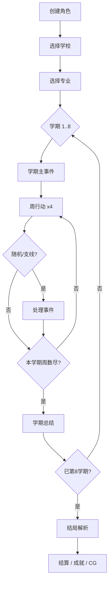

# 本科生四年日记 · 游戏详细介绍

> **平台**：微信小游戏（Canvas 文字策略模拟）  
> **英文名**：Undergraduate Simulation  
> **商店检索名**：本科生四年日记  
> **声明**：游戏中的学校、人物与剧情均为虚构，与现实院校及人物无关。

---

## 目录

1. [游戏概述](#1-游戏概述)
2. [核心玩法与一局流程](#2-核心玩法与一局流程)
3. [角色创建](#3-角色创建)
4. [属性系统](#4-属性系统)
5. [学校与专业](#5-学校与专业)
6. [时间结构：学期与周](#6-时间结构学期与周)
7. [事件与行动](#7-事件与行动)
8. [NPC 与人际关系](#8-npc-与人际关系)
9. [天赋系统](#9-天赋系统)
10. [社团与周常扩展](#10-社团与周常扩展)
11. [道具、背包与周行动商店](#11-道具背包与周行动商店)
12. [目标系统](#12-目标系统)
13. [结局与路线](#13-结局与路线)
14. [成就、CG 与 BGM 收藏](#14-成就cg-与-bgm-收藏)
15. [难度与 Meta 进度](#15-难度与-meta-进度)
16. [存档与结算回顾](#16-存档与结算回顾)
17. [界面与场景一览](#17-界面与场景一览)
18. [内容规模（数据概览）](#18-内容规模数据概览)
19. [适合什么样的玩家](#19-适合什么样的玩家)
20. [开发与内容维护说明](#20-开发与内容维护说明)

---

## 1. 游戏概述

《本科生四年日记》是一款以**大学四年**为时间跨度的**文字策略生活模拟**游戏。你不是在操作角色跑图或战斗，而是通过阅读剧情、在分支选项中做选择、每周规划行动，在**绩点、健康、压力、社交、能力、金钱**等多维资源之间做权衡，最终走向截然不同的毕业结局。

游戏气质介于「人生模拟器」与「互动小说」之间：有大量带梗的中文叙事、贴近校园日常的随机事件（熬夜、食堂、ddl、实习、考公、恋爱等），同时底层是完整的数据驱动规则——学校、专业、天赋、道具、标志位（flags）共同决定你能触发哪些事件和结局。

**一句话概括**：选校选专业 → 带天赋开局 → 8 个学期里每周做选择 → 经营属性与人脉 → 解锁成就与 CG → 在百种结局里看见另一种大学生活。

---

## 2. 核心玩法与一局流程

### 2.1 基本循环

每一局（Run）从**创建角色**开始，经历 **8 个学期**，每学期包含：

| 阶段 | 说明 |
|------|------|
| **学期主事件**（`main_event`） | 每学期开场的大型剧情节点，通常与年级、专业线或校园节点相关；做出选择后进入本学期周行动。 |
| **周行动**（`week_action`） | 每学期 **4 周**，每周从行动列表中选一项执行（自习、兼职、社交、科研等），消耗时间并改变属性。 |
| **支线事件**（`side_event`，概率触发） | 周行动后可能触发；处理完毕后推进到下一周或学期结束。 |
| **随机突发事件** | 周行动结算时可能插入（感冒、停电、羊毛券、学业窗口等），进一步扰动节奏。 |
| **学期总结** | 每学期结束时弹出定性回顾（偏叙事，少裸数字），并刷新学期目标等。 |
| **结局判定** | 第 8 学期结束后根据属性、标志位与优先级解析唯一结局；严苛结局（休学、崩溃、学业预警等）可在学期中提前触发。 |

因此，一局完整通关大约包含：**8 次学期主事件 + 32 次周行动**，外加若干支线、随机事件与 NPC 专属剧情——实际读到的文本量远大于「32 回合」。

### 2.2 单周行动结算链（简化）

```
选择周行动 → 扣除金钱成本 → 应用行动效果
    → 结算状态效果（持续 buff/debuff）
    → 可能触发随机事件
    → 可能获得道具
    → 可能完成「本周小目标」
    → 概率进入支线事件
    → 否则：剩余周数 -1；若本学期周数用尽则进入新学期主事件
    → 可能解锁 CG / 写入冒险日志 / 自动存档
```

### 2.3 决策本质

游戏的核心张力是**不可兼得的资源**：

- 刷绩点往往抬高压力、损害健康；
- 社交与社团消耗时间与金钱，但解锁人脉与恋爱线；
- 实习、科研、考公、创业各自对应不同的 **flags**，决定后期能抽到的结局池；
- 天赋会放大或削弱某类选项（夜猫子、社交达人、贫困但会省钱等）。

没有唯一「正确答案」，只有与你选定的**主目标**（学术 / 就业 / 关系 / 生存）是否一致的人生轨迹。

---

## 3. 角色创建

创建角色时可自定义：

| 项目 | 说明 |
|------|------|
| **姓名** | 从预设男女名库随机或自选，影响叙事中的称呼。 |
| **性别** | 影响可选头像与部分恋爱 NPC 池。 |
| **头像** | 男女各 4 款立绘头像。 |
| **难度** | 简单 / 普通 / 困难，影响数值缩放、负面惩罚与严苛结局阈值。 |
| **天赋** | 开局从随机池中选取 1 个（可刷新），提供属性修正与特殊机制标签。 |

创建完成后依次进入 **选学校 → 选专业**（需符合该校「核心 / 跨学科」矩阵），然后正式进入大一上学期。

---

## 4. 属性系统

### 4.1 六大核心属性

| 属性 | 中文 | 范围（约） | 作用简述 |
|------|------|------------|----------|
| `gpa` | 绩点 | 0 ~ 4.0 | 学业表现；影响保研、学业预警、多种结局门槛。 |
| `money` | 金钱 | 0 ~ 极高上限 | 支付行动成本、购物、应对消费类事件。 |
| `health` | 健康 | 0 ~ 100 | 过低可能触发休学类严苛结局。 |
| `social` | 社交 | 0 ~ 100 | 人脉、社团、恋爱与部分结局。 |
| `skill` | 能力 | 0 ~ 100 | 竞赛、科研、实习与职场向结局。 |
| `pressure` | 压力 | 0 ~ 100 | 过高可能触发情绪崩溃等结局；与阈值事件联动。 |

初始基准（未计学校/专业修正）约为：绩点 2.8、金钱 2000、健康 80、社交 50、能力 45、压力 28。学校与专业会在此基础上叠加正负修正，**跨学科就读**（非本校核心、仅列在 cross 列表的专业）会额外承受绩点、压力等惩罚，但也会带来一定社交补偿。

### 4.2 关键阈值（普通难度参考）

- 压力偏高警告：约 ≥ 85  
- 健康偏低警告：约 ≤ 35  
- 金钱紧张：约 ≤ 500  
- 社交活跃：约 ≥ 72  

简单模式会放宽高压/低健康判定；困难模式会更早亮起红灯。

### 4.3 隐藏进度：Flags

除六项属性外，大量剧情与结局依赖 **flags**（布尔或计数），例如：

- `civilTrack` — 考公路线  
- `publicInstitutionTrack` — 考编 / 事业单位  
- `researchTrack` / `postgradLockedIn` — 科研与保研  
- `internshipReady` / `careerBigTech` — 实习与互联网就业  
- `romanceCommitted` / `romanceSkipped` — 恋爱走向  
- `startupIntent` — 创业意向  
- `studentWork` — 学生工作 / 班委  
- `contestProgress` / `researchProgress` — 竞赛与科研进度  

同一局内多次选择会累积这些标记，最终在结局解析时与属性一并判定。

---

## 5. 学校与专业

### 5.1 学校类型（15 所）

每所学校有独立名称、一句梗概式 **tagline** 与初始属性修正，并影响「课业强度」「实习就业倾向」等隐藏权重。学校列表包括（节选）：

| ID | 名称 | 风味关键词 |
|----|------|------------|
| `top2` | 清北复交联盟 | 高绩点地板、高压、社交内卷 |
| `comprehensive` | 双一流综合大学 | 通识缓冲、社交面广 |
| `polytech` | 985 理工强校 | 硬技能、项目、ddl |
| `local` | 省属重点大学 | 生活节奏舒缓、金钱与健康友好 |
| `normal_key` | 211 重点大学 | 均衡课业与社交 |
| `finance` | 两财一贸 | 现金流、实习密度 |
| `teacher` | 部属师范院校 | 学业与健康稳定 |
| `med` | 医学类院校 | 高能力成长、极高压力 |
| `sino_foreign` | 中外合办学院 | 双语与国际人脉、生活成本高 |
| `art_academy` | 艺术类院校 | 审美、社交、作品集文化 |
| `military_academy` | 军事院校 | 体质与执行力、纪律压力 |
| `agricultural` | 农林类院校 | 动手与生活补贴感 |
| `foreign_language` | 外语类院校 | 语言与社交加成 |
| `police_academy` | 政法类院校 | 综合素质、考公法务向 |
| `vocational` | 职业技术大学 | 就业技能与收入向 |

> 开局默认解锁部分学校；其余需通过**通关次数、成就或特定结局**解锁（见 Meta 进度）。

### 5.2 专业（12 个）

| ID | 专业名称 |
|----|----------|
| `cs` | 计算机科学与技术 |
| `se` | 软件工程 |
| `ee` | 电子信息工程 |
| `ai` | 人工智能 |
| `data_science` | 数据科学与大数据技术 |
| `biz` | 工商管理 |
| `finance_major` | 金融学 |
| `liberal` | 汉语言文学 |
| `law` | 法学 |
| `news` | 新闻传播学 |
| `medicine` | 临床医学 |
| `civil_exam` | 公共管理（考公向） |

每个专业有独立的属性修正与 tagline；与不同学校组合时还可能触发 **学校×专业** 额外修正（例如顶尖联盟读 AI 会再叠压力等）。

### 5.3 核心专业 vs 跨学科

每所学校在配置中划分 **core**（本校强势/常规专业）与 **cross**（允许但带惩罚的跨选）。跨学科开局会额外承受：绩点 -0.12、压力 +8、健康 -2、社交 +2 等修正，且隐藏课业强度略升——适合想要「挑战剧本」的玩家。

---

## 6. 时间结构：学期与周

| 参数 | 数值 |
|------|------|
| 总学期数 | **8**（大致对应大一上至大四下） |
| 每学期周数 | **4** |
| 每学期周行动次数 | **4**（与周数一致） |
| 一局最少周行动 | **32** |

学期索引从 0 开始计数；UI 与日志中通常以「第 N 学期」「第 M 周」展示。第 7 学期及以后常见论文、答辩、求职类叙事与 CG 解锁条件。

---

## 7. 事件与行动

### 7.1 学期主事件与支线

- **主事件库**：约 **51** 条大型事件（`config/v1/events.json`），按学期、学校、专业、flags 等条件筛选；每学期开局抽取尚未使用的一条。  
- **支线**：周行动后以一定概率（与导师关系等有关）追加较短事件，丰富每周后果。  
- **叙事特点**：选项带 `effects`（属性变化）与后续叙事文本；部分选项关联 `npcRef`，推进好感与专属剧情。

### 7.2 周行动

- **基础行动库**：约 **36** 种（`config/v1/actions.json`），涵盖学习、生活、娱乐、社交、兼职等。  
- 每条行动包含：**标题、描述、金钱成本、属性效果、标签（tags）、长叙事文本**。  
- 行动可按标签过滤或排序（学业 / 社交 / 社团等）；加入社团后还会**动态注入社团专属行动**（吉他练习、篮球训练、外拍等）。

### 7.3 随机事件

- **随机事件库**：约 **27** 条（`config/v1/randomEvents.json`）。  
- 在周行动结算后触发；近期已触发的事件会被降权，减少连续「感冒两次」式的重复感。  
- 题材覆盖：健康、金钱、学业窗口、宿舍矛盾、热搜分心、拼单、停电、云盘灾难、校友内推等。

### 7.4 事件引擎

核心逻辑位于 `js/core/eventEngine.js`：

- 条件判定（属性、学期、周、学校、专业、flags）  
- 效果应用与**难度缩放**（正面/负面不同倍率）  
- 结局解析（多结局按 **priority** 排序，先匹配者优先）  
- 随机事件、道具掉落、状态效果 tick  

内容策划可通过 `config/v1/*.json` 扩展，再运行 `tools/sync-catalog-from-json.mjs` 同步到运行时目录。

---

## 8. NPC 与人际关系

### 8.1 角色类型

游戏内置约 **24** 名结构化 NPC（`config/v1/npcs.json`），分四类：

| 角色 | 示例风味 |
|------|----------|
| **室友** (`roommate`) | 卷王早起、佛系养生、电竞外放、社牛班委、二次元手作、夜猫子实验党等 |
| **导师** (`mentor`) | 科研严师、工程项目派、考公派、温柔刀、毒舌、佛系摸鱼等 |
| **恋爱对象** (`romance`) | 直球运动系、慢热小作文、嘴硬占座、犬系干饭、甜系文艺、理性日程表等 |
| **学长姐** (`senior`) | 创业老江湖、大厂内推、考公笔记、支教温柔系等 |

每名 NPC 有：标签、简介、基础好感、亲近/疏远阈值、专属 meme 句。

### 8.2 关系数值

除 NPC 个人好感（`npcAffinity`）外，保留四条传统关系条：

- 室友 `roommate`  
- 导师 `mentor`  
- 恋人 `partner`  
- 学长姐 `senior`  

选择与谁互动、是否确立恋爱关系、是否解锁导师，会影响支线概率与结局池。

### 8.3 运行时

`js/core/npcRuntime.js` 负责开局生成室友/导师/恋爱候选人 roster、好感增减、专属事件命中统计等。结算界面会回顾：**导师名、恋人名、好感概况、NPC 专属事件次数**。

---

## 9. 天赋系统

开局可从约 **48** 个天赋中抽取（`talentsCatalog`），分为四档：

| 档位 | 含义 |
|------|------|
| **正向** (`positive`) | 明显有利，如学霸、社交达人、幸运星 |
| **平衡** (`balanced`) | 有利有弊或机制型 |
| **负向** (`negative`) | 开局更难，但可能专精某条线 |
| **地狱** (`hell`) | 极端挑战向 |

每个天赋除属性修正外，还可带 `specialEffects` 标签，例如：

- `nightBonus` / `nightPenalty` — 熬夜相关  
- `studyBonus` / `studyPenalty` — 学业选项  
- `socialBonus` / `gamingBonus` / `sportsBonus` — 场景加成  
- `stressImmunity` — 抗压  
- `viralEvents` / `memeBonus` — 趣味随机事件权重  

天赋支持**刷新重 roll**；建角时也会自动分配一个非「无天赋」的默认选项，避免空天赋开局。

---

## 10. 社团与周常扩展

- 社团名称由前缀 + 类型随机组合（如「星光辩论社」「晨曦志愿者协会」）。  
- **加入社团**后解锁对应周行动；重复加入会提示已是成员。  
- 社团行动带 `club` 标签，会额外推高社交等属性，并参与学期目标判定。

这与「学生工作」「志愿」等 flags 叠加，可导向班委、支教、社团排练类 CG。

---

## 11. 道具、背包与周行动商店

### 11.1 道具（8 种基础消耗品/状态品）

| 道具 | 效果概要 |
|------|----------|
| 咖啡券 | 立刻减压 |
| 学长笔记 | 立刻提升绩点 |
| 健身体验卡 | 数周健康 buff |
| 记账手册 | 金钱 + 减压 |
| 食堂储值券 | 健康 + 金钱 |
| 导师推荐信模板 | 能力 + 社交 |
| 睡眠修复贴 | 减压 + 持续健康 |
| 考试好运签 | 绩点 up、压力略升 |

道具可在事件中掉落，或在**周行动「外出购物」**时购买。

### 11.2 周行动商店

- 每周从货架中随机展示 **3** 件商品；  
- 确认购买时另收 **路费**（默认 12）；  
- 价格随年级阶段浮动：大一略便宜，大三大四「冲刺季」略贵；金钱过低时有轻微折扣保底。

### 11.3 背包

游戏中可打开背包界面使用消耗品；状态类道具会注册持续数周的 `statusEffects`，在每周行动后自动结算。

---

## 12. 目标系统

采用**三层目标**设计（`GOAL_SYSTEM_CONFIG`）：

1. **主目标（Core Goal）** — 开局四选一，定调整局方向：  
   - 学术进阶 / 就业冲刺 / 关系经营 / 稳态生存  

2. **学期目标** — 每学期刷新约 **3** 条，引导本学期关注重点。  

3. **每周小目标** — 每周行动前分配，完成与否会在行动后给出反馈队列。  

目标完成与否主要依赖行动标签与属性变化，不会在 UI 上过度刷屏数值，而更像「本周小任务」的轻度引导。

---

## 13. 结局与路线

### 13.1 规模

结局库约 **100** 个（`config/v1/endings.json`），按 **priority** 从高到低匹配，确保「严苛结局」优先于普通毕业。

### 13.2 严苛结局（示例）

| 结局 | 触发逻辑概要 |
|------|----------------|
| 休学调整 | 健康极低 |
| 情绪崩溃 | 压力极高 |
| 学业预警 | 绩点过低 |
| 现金流危机 | 金钱枯竭类 |

简单难度会提高触发门槛；困难难度更容易撞上。

### 13.3 路线型结局（示例分类）

- **升学**：保研、科研直博、临床深造、间隔年出国、再战考公等  
- **就业**：大厂 offer、互联网中厂、内容运营、法律实务、柜员线、高压入职等  
- **体制内**：考公上岸、考编上岸、青年教师、城市治理等  
- **创业**：小队创业、创业受挫但成长、导师资源嫁接、寝室三人组试水等  
- **情感**：恋爱毕业双线、异地恋、体面分手、图书馆牵手线、跳过恋爱的大四等  
- **生活态**：普通毕业、优秀毕业生、健康优先、高分孤岛、人脉连接者、财务自由预备役等  

许多结局附带 **epilogue（后记）** 文本，在时间跳跃后交代五年后的剪影。

### 13.4 结局画廊

已解锁结局可在 **结局画廊** 中回顾标题、描述与后记，支持结局播放模式。

---

## 14. 成就、CG 与 BGM 收藏

### 14.1 成就

约 **98** 个成就（`config/v1/achievements.json`），条件包括：

- 首次通关、特定属性阈值、flags 组合  
- 指定结局、非退学通关、恋爱线、实习线、考公考编等  

成就带 **hint** 提示，未解锁时也可浏览挑战方向。解锁可反哺 **学校/专业解锁**（如达成绩点成就解锁顶尖联盟）。

### 14.2 CG 画廊

约 **25** 张剧情 CG（入学、宿舍、食堂、期中、黑客松、实验室、辩论、球赛、志愿、图书馆、实习面试、Offer、答辩、毕业典礼等），解锁条件与学期、属性、flags 挂钩。满足条件时在游戏过程中弹出，并永久记入 CG 图鉴。

### 14.3 BGM 收藏

曲目随场景推进解锁（主菜单、建角、选校、周行动、结局、图鉴等），可在 **BGM 画廊** 试听已解锁音乐。

---

## 15. 难度与 Meta 进度

### 15.1 三档难度

| 难度 | 体验差异 |
|------|----------|
| **简单** | 负面效果减弱，严苛结局更难触发，高压/低健康阈值更宽松 |
| **普通** | 默认平衡曲线 |
| **困难** | 负面惩罚加重，严苛结局更易出现，红线更早 |

### 15.2 解锁进度

- **学校**：通关次数、特定成就或结局（如创业结局解锁中外合办、考公结局解锁政法院校等）  
- **专业**：通关次数、成就、结局（如大厂结局解锁金融专业、恋爱成就解锁新闻等）  
- 默认解锁学校：双一流综合、省属重点、985 理工；默认专业：计算机、工商、汉语言  

Meta 数据保存在微信本地存储（`js/core/save.js`），包括：通关次数、已解锁结局、成就、CG、BGM 等。

---

## 16. 存档与结算回顾

- **自动存档**：关键节点（事件选择、周行动、学期切换）后写入当前 Run。  
- **冒险日志**：本局每条选择记入 `log`，可在「本局日志」场景滚动查看（含学期/周/阶段标签）。  
- **结算页**：结局后展示统计——主/支/周行动条数、最常进行的行动、最终属性、路线关键词、NPC 互动概况、已解锁结局与成就总数等。  
- **学期总结**：每学期末的定性文案由 `js/core/semesterSummary.js` 根据本学期日志与属性生成，避免干巴巴的数字列表。

---

## 17. 界面与场景一览

| 场景 | 功能 |
|------|------|
| `menu` | 主菜单：新游戏、继续、图鉴入口 |
| `create_role` | 创建角色（名、性别、头像、难度、天赋） |
| `school` / `major` | 选择学校与专业 |
| `play` | 主游戏：属性条、事件、周行动、购物 overlay |
| `inventory` | 背包使用道具 |
| `relations` | 关系与 NPC 概览 |
| `ending` / `ending_playback` | 结局展示与回放 |
| `gallery` | 结局画廊 |
| `achievements` / `achievement_playback` | 成就列表与详情 |
| `cg_gallery` / `cg_playback` | CG 图鉴与全屏观赏 |
| `bgm_gallery` | 音乐收藏 |
| `run_log` | 本局冒险日志 |
| `credits` | 制作与致谢 |

整体为 **竖屏 Canvas UI**，配色与圆角、字号由 `config/v1/uiTheme.json` 驱动。

---

## 18. 内容规模（数据概览）

| 类型 | 约数量 | 配置位置 |
|------|--------|----------|
| 结局 | 100 | `config/v1/endings.json` |
| 成就 | 98 | `config/v1/achievements.json` |
| 学期主事件 | 51 | `config/v1/events.json` |
| 周行动 | 36 | `config/v1/actions.json` |
| 随机事件 | 27 | `config/v1/randomEvents.json` |
| 天赋 | 48 | catalog / 嵌入数据 |
| NPC | 24 | `config/v1/npcs.json` |
| 道具 | 8 | `config/v1/items.json` |
| 学校 | 15 | `config/v1/rules.js` |
| 专业 | 12 | `config/v1/rules.js` |
| CG | 25 | `js/main.js` CG_CATALOG |
| 学期 | 8 × 4 周 | `config/v1/rules.js` |

> 以上为工程内静态配置规模；实际游玩中因分支、随机与社团动态行动，文本体验远丰富于表格数字。

---

## 19. 适合什么样的玩家

- 喜欢 **中国式校园梗**、群聊语录、ddl 文化的玩家；  
- 偏好 **文字 + 数值策略**、而非动作操作的用户；  
- 愿意 **多周目刷解锁**（学校、专业、结局、成就、CG）的收集型玩家；  
- 想以轻松方式体验「如果当初选了另一专业 / 另一条路线」的 Alternate Universe 叙事爱好者。

不太适合：追求即时操作、开放世界沙盒、或写实 3D 校园模拟的玩家。

---

## 20. 开发与内容维护说明

- **引擎**：微信小游戏 + Canvas 2D + ES Module。  
- **入口**：`game.js` → `js/main.js`（主循环、场景、渲染、输入）。  
- **规则版本**：当前为 **v4**（8 学期 × 周行动主轴）。  
- **数据管线**：编辑 `config/v1/*.json` → 运行 `node tools/sync-catalog-from-json.mjs` → 同步至 `js/data/catalog.js`。  
- **授权**：程序代码 MIT；剧情、数值、图片、音频为作者保留权利（见 `ASSETS_NOTICE.md`）。  
- **广告**：开源/本地构建默认关闭激励视频（`js/ads/adAdapter.js`）。

---

## 附录：一局时间轴示意



---

*文档根据仓库 `config/v1` 与 `js/main.js` 等源码整理，随版本更新可能略有出入。游玩请以微信小游戏正式版为准。*
